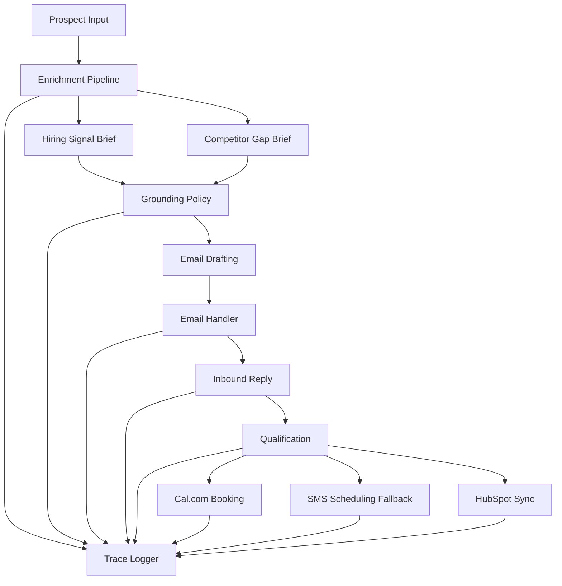

# Project Architecture

The system is intentionally organized as a local, audit-friendly conversion engine:

The implementation keeps outbound traffic in sink mode until live providers are intentionally enabled. The runtime is designed around traceable artifacts rather than opaque side effects, so each operational step has a file-based evidence surface.
