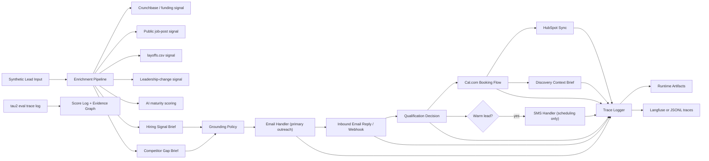

# Tenacious Conversion Engine

This repository contains the Week 10 build for the Tenacious Consulting and Outsourcing conversion engine challenge. The current implementation is centered on the challenge's email-first channel hierarchy: enrichment runs before outreach, email is the primary first touch, SMS is reserved for warm-lead scheduling, and the final delivery step is a human discovery call supported by a generated context brief.

## Architecture



## Design Rationale

- `Email first`: the challenge is explicit that Tenacious prospects live in email, not cold SMS. The first touch is therefore email, with SMS gated to warm leads who already replied and want fast coordination.
- `Enrichment before outreach`: the value proposition is research, not template blasting. The system builds the hiring-signal and competitor-gap briefs first, then composes outreach from those artifacts.
- `HubSpot after qualification and booking`: CRM writes matter most once the signal, conversation state, and booking outcome are all available; that makes the record more useful to the delivery lead.
- `Cal.com plus discovery brief`: the final system handoff is not just a slot on a calendar. The booking step also produces a structured discovery context brief so the human lead inherits the conversation with context.
- `Trace-backed implementation`: runtime actions and eval evidence are written to artifacts and traces so the demo and report can point to concrete files rather than unverifiable claims.

## Implemented Scope

- email-first outreach flow with warm-lead SMS scheduling fallback
- inbound and outbound handlers for email and SMS
- public-signal enrichment pipeline for funding, job posts, layoffs, leadership change, and AI maturity
- competitor-gap brief generation using the attached reference benchmark
- self-hosted Cal.com booking client with API mode and explicit fallback mode
- HubSpot-shaped CRM sync with enrichment timestamp and signal fields
- runtime trace logging to JSONL with optional Langfuse mirroring when credentials and SDK are available
- tau2 retail baseline score and trajectory evidence
- operator UI that runs the pipeline, refreshes evidence, and recomputes eval scores from the browser

## Requirements

The local demo runs on Python and the standard library. The current handoff was validated on:

- `Python 3.13.12`
- `langfuse==3.0.0`
- `playwright==1.52.0`

The challenge-aligned optional integrations use the dependencies listed in:

- [requirements.txt](/Users/gersumasfaw/Downloads/week_10/requirements.txt)
- [agent/requirements.txt](/Users/gersumasfaw/Downloads/week_10/agent/requirements.txt)

Optional packages currently referenced:

- `playwright` for public-page enrichment when installed
- `langfuse` for direct trace mirroring when `LANGFUSE_PUBLIC_KEY`, `LANGFUSE_SECRET_KEY`, and `LANGFUSE_HOST` are configured

## Directory Index

- `agent`: application code for orchestration, enrichment, channel handlers, CRM/calendar clients, policies, storage, and trace logging.
- `artifacts`: runtime outputs produced by the operator UI and local pipeline runs, including email, SMS, CRM, calendar, state, and brief artifacts.
- `briefs`: committed sample brief outputs used for review and schema comparison.
- `data`: Tenacious source material, schemas, policy docs, seeded sales materials, and challenge-approved baseline numbers.
- `docs`: interim writeups and handoff-oriented narrative documents.
- `eval`: imported or regenerated benchmark traces, baseline summaries, and score logs.
- `infra`: local infrastructure entry points, including the Cal.com Docker compose stack and setup notes.
- `probes`: adversarial probe definitions, failure taxonomy, and target failure mode notes.
- `tests`: smoke tests covering the thin-slice pipeline and key integrations.
- `visualization`: local operator UI server and browser-facing evidence explorer.
- `ablation_results.json`: held-out evaluation summary for the TAMSG method and comparison runs.
- `baseline.md`: human-readable snapshot of the imported τ² retail baseline.
- `evidence_graph.json`: machine-readable mapping from memo claims to source artifacts.
- `held_out_traces.jsonl`: held-out evaluation trajectories referenced by the evidence graph.
- `memo.md`: executive memo for the challenge submission.
- `memo_final.pdf`: exported memo artifact.
- `method.md`: mechanism-design document for TAMSG.
- `PROJECT_ARCHITECTURE.md`: shorter architecture overview for reviewers who want only the system map.

## Setup

### Boot order

Run local bootstrap in this order:

1. Install Python dependencies.
2. Populate `.env` from `.env.example`.
3. Start Cal.com if you want local booking.
4. Start the operator UI.
5. Run the pipeline or tests.

### 1. Install optional dependencies

```bash
python3 -m pip install -r requirements.txt
```

If you want Playwright-based collection locally, also install browser binaries:

```bash
python3 -m playwright install chromium
```

### 2. Configure environment

The app reads values from `.env` when present. Start from `.env.example`. The most important variables are:

| Variable | Meaning | Typical local value |
|---|---|---|
| `APP_NAME` | Label attached to traces and provider metadata. | `tenacious-conversion-engine` |
| `APP_ENV` | Runtime environment name. | `development` |
| `SINK_MODE` | Forces outbound channels into artifact-only mode. Keep this `true` for safe demos. | `true` |
| `LIVE_OUTBOUND_ENABLED` | Enables live provider mode when sink mode is off. Must not be `true` together with `SINK_MODE=true`. | `false` |
| `USE_SEEDED_DEMO_DATA` | Uses seeded Tenacious examples instead of live public collection when available. | `false` |
| `DEFAULT_SDR_EMAIL` | Sales-owner email attached to discovery bookings. | `delivery-lead@example.com` |
| `OPENROUTER_API_KEY` | Enables live LLM drafting through OpenRouter. | empty unless intentionally enabled |
| `OPENROUTER_MODEL` | Model name for live drafting. | `openai/gpt-4.1-mini` |
| `OPENROUTER_BASE_URL` | OpenRouter API base URL. | `https://openrouter.ai/api/v1` |
| `HUBSPOT_ACCESS_TOKEN` | Reserved for future live HubSpot wiring; current repo persists local snapshots instead. | empty |
| `HUBSPOT_PORTAL_ID` | Reserved for future live HubSpot wiring. | empty |
| `CALCOM_BASE_URL` | General Cal.com base URL used by the booking client. | `http://127.0.0.1:3004` |
| `CALCOM_APP_BASE_URL` | UI-origin Cal.com URL used for booking links and legacy local booking fallback. | `http://127.0.0.1:3004` |
| `CALCOM_API_BASE_URL` | Separate API-v2 origin if your self-hosted setup exposes one. | `http://127.0.0.1:3003` |
| `CALCOM_API_KEY` | API key for live Cal.com booking attempts. | `cal_...` |
| `CALCOM_EVENT_TYPE_SLUG` | Event type slug used for standard booking API payloads. | `30min` |
| `CALCOM_EVENT_TYPE_ID` | Event type ID used for local legacy `/api/book/event` fallback. | `1` |
| `CALCOM_API_VERSION` | Version header sent to Cal.com v2 endpoints. | `2026-02-25` |
| `CALCOM_USERNAME` | Host username passed to Cal.com when required by the booking endpoint. | your local Cal.com username |
| `CALCOM_WEBHOOK_SECRET` | Shared secret for validating inbound Cal.com webhooks. | empty unless configured |
| `CALCOM_BOOKING_START` | Initial desired booking slot before fallback and retry logic adjust it. | `2026-04-28T09:00:00Z` |
| `CALCOM_FALLBACK_ENABLED` | Allows clearly labeled simulated bookings when live booking fails. | `true` |
| `RESEND_API_KEY` | Reserved for future live Resend transport. Current repo still uses sink artifacts. | empty |
| `MAILERSEND_API_KEY` | Reserved for future live MailerSend transport. | empty |
| `AFRICASTALKING_API_KEY` | Reserved for future live Africa's Talking transport. | empty |
| `AFRICASTALKING_USERNAME` | Provider username for future live SMS transport. | `sandbox` |
| `LAYOFFS_CSV_PATH` | Path to the layoffs CSV snapshot used by `LayoffsLookup`. | `/Users/.../layoffs.csv` |
| `RUNTIME_ARTIFACTS_PATH` | Folder where the pipeline writes runtime artifacts. | `artifacts/runtime` |
| `TRACE_OUTPUT_PATH` | JSONL trace file written by the pipeline. | `artifacts/traces/agent_trace_log.jsonl` |
| `SCORE_OUTPUT_PATH` | Score log regenerated from eval traces. | `eval/score_log.json` |

### 3. Run the operator UI

```bash
python3 visualization/server.py
```

Open:

```text
http://127.0.0.1:8000/visualization/
```

From the UI you can:

- run the full pipeline
- recompute `eval/score_log.json` from `eval/trace_log.jsonl`
- refresh visible evidence
- inspect every generated artifact in the artifact explorer

### 3a. Run self-hosted Cal.com via Docker

```bash
docker compose -f infra/docker-compose.yml up -d
```

Then complete the first-run setup in Cal.com, generate an API key, and copy the values into `.env`. The compose stack exposes the web app on `3004`; if you also want live booking API calls on `3003`, run a real Cal.com API service separately instead of mapping `3003` back to the web container. More detail is in [infra/README.md](/Users/gersumasfaw/Downloads/week_10/infra/README.md).

### 4. Run the pipeline directly from the terminal

```bash
python3 -m agent.main
```

### 5. Run tests

```bash
python3 -m unittest discover -s tests -v
```

## Demo Flow

For a reviewer-friendly walkthrough, use:

- [DEMO_README.md](/Users/gersumasfaw/Downloads/week_10/DEMO_README.md)

That guide walks through the exact browser steps to demonstrate:

- enrichment
- email generation
- simulated reply and qualification
- Cal.com booking artifact, including whether the run used `api` mode or `fallback` mode
- HubSpot artifact with enrichment fields
- SMS warm-lead scheduling
- traces, score log, and evidence graph

## Key Outputs

- Runtime artifacts: [artifacts/runtime](/Users/gersumasfaw/Downloads/week_10/artifacts/runtime)
- Trace log: [artifacts/traces/agent_trace_log.jsonl](/Users/gersumasfaw/Downloads/week_10/artifacts/traces/agent_trace_log.jsonl)
- Evaluation evidence: [eval](/Users/gersumasfaw/Downloads/week_10/eval)
- Baseline summary: [baseline.md](/Users/gersumasfaw/Downloads/week_10/baseline.md)
- Evidence graph: [evidence_graph.json](/Users/gersumasfaw/Downloads/week_10/evidence_graph.json)
- Interim report: [docs/interim_submission_report.md](/Users/gersumasfaw/Downloads/week_10/docs/interim_submission_report.md)

## Honest Status

What is strong right now:

- local end-to-end thin slice
- rubric-aligned email and SMS handler behavior
- structured enrichment outputs and CRM snapshot fields
- trace-backed operator UI demo
- imported tau2 dev baseline evidence

What still depends on real external accounts or additional benchmark work:

- live Resend or MailerSend delivery
- live Africa's Talking round-trips
- live HubSpot Developer Sandbox writes
- verified live Cal.com calendar writes against a running local Cal.com web app plus a separate API service in this workspace
- verified Langfuse cloud traces
- Acts III through V deliverables such as probes, ablations, held-out traces, and final memo

## Handoff Notes

Concrete successor issues to expect immediately:

- Email is still a sink adapter, not a real Resend or MailerSend transport, even when provider keys are present.
- SMS is still a sink adapter, not a real Africa's Talking client.
- HubSpot writes are local snapshot artifacts, not live CRM object creation or activity logging.
- Cal.com local booking works best through the web-app-backed legacy endpoint; some self-hosted images expose `/api/v2/bookings` as a broken proxy unless a separate API service is running.
- Public-signal enrichment is compliance-aware and traceable, but it does not yet implement a true 60-day job-post velocity computation or source-specific scrapers for BuiltIn, Wellfound, and LinkedIn public pages.
- AI maturity scoring and competitor-gap generation are simplified heuristics and do not yet satisfy the full challenge spec for peer selection, weighted six-signal scoring, or sector-position math.
- Probe, taxonomy, and target-failure documents still need a successor pass to remove placeholders and tie every claimed rate back to an explicit artifact.
