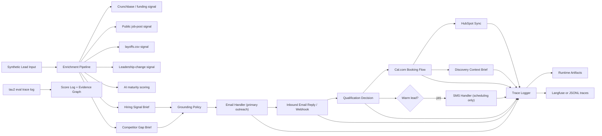

# Tenacious Conversion Engine

This repository contains the Week 10 build for the Tenacious Consulting and Outsourcing conversion engine challenge. The current implementation is centered on the challenge's email-first channel hierarchy: enrichment runs before outreach, email is the primary first touch, SMS is reserved for warm-lead scheduling, and the final delivery step is a human discovery call supported by a generated context brief.

## Architecture



## Design Rationale

- `Email first`: the challenge is explicit that Tenacious prospects live in email, not cold SMS. The first touch is therefore email, with SMS gated to warm leads who already replied and want fast coordination.
- `Enrichment before outreach`: the value proposition is research, not template blasting. The system builds the hiring-signal and competitor-gap briefs first, then composes outreach from those artifacts.
- `HubSpot after qualification and booking`: CRM writes matter most once the signal, conversation state, and booking outcome are all available; that makes the record more useful to the delivery lead.
- `Cal.com plus discovery brief`: the final system handoff is not just a slot on a calendar. The booking step also produces a structured discovery context brief so the human lead inherits the conversation with context.
- `Trace-backed implementation`: runtime actions and eval evidence are written to artifacts and traces so the demo and report can point to concrete files rather than unverifiable claims.

## Implemented Scope

- email-first outreach flow with warm-lead SMS scheduling fallback
- inbound and outbound handlers for email and SMS
- public-signal enrichment pipeline for funding, job posts, layoffs, leadership change, and AI maturity
- competitor-gap brief generation using the attached reference benchmark
- self-hosted Cal.com booking client with API mode and explicit fallback mode
- HubSpot-shaped CRM sync with enrichment timestamp and signal fields
- runtime trace logging to JSONL with optional Langfuse mirroring when credentials and SDK are available
- tau2 retail baseline score and trajectory evidence
- operator UI that runs the pipeline, refreshes evidence, and recomputes eval scores from the browser

## Requirements

The local demo runs on Python and the standard library. The challenge-aligned optional integrations use the dependencies listed in:

- [requirements.txt](/Users/gersumasfaw/Downloads/week_10/requirements.txt)
- [agent/requirements.txt](/Users/gersumasfaw/Downloads/week_10/agent/requirements.txt)

Optional packages currently referenced:

- `playwright` for public-page enrichment when installed
- `langfuse` for direct trace mirroring when `LANGFUSE_PUBLIC_KEY`, `LANGFUSE_SECRET_KEY`, and `LANGFUSE_HOST` are configured

## Setup

### 1. Install optional dependencies

```bash
python3 -m pip install -r requirements.txt
```

If you want Playwright-based collection locally, also install browser binaries:

```bash
python3 -m playwright install chromium
```

### 2. Configure environment

The app reads values from `.env` when present. The most relevant settings are:

- `SINK_MODE=true` for safe local demo mode
- `LIVE_OUTBOUND_ENABLED=false` unless you intentionally wire real providers
- `LAYOFFS_CSV_PATH=/Users/gersumasfaw/Downloads/layoffs.csv`
- `CALCOM_BASE_URL=http://127.0.0.1:3001`
- `CALCOM_API_BASE_URL=http://127.0.0.1:3003`
- `CALCOM_API_KEY`, `CALCOM_EVENT_TYPE_SLUG`, and `CALCOM_USERNAME` for self-hosted Cal.com booking
- `CALCOM_WEBHOOK_SECRET` if you want the local operator server to validate inbound Cal.com webhooks
- `CALCOM_FALLBACK_ENABLED=true` if you want a clearly labeled simulated booking whenever the local Cal.com stack is unavailable
- `LANGFUSE_PUBLIC_KEY`, `LANGFUSE_SECRET_KEY`, `LANGFUSE_HOST` for optional Langfuse export
- `OPENROUTER_API_KEY` and `OPENROUTER_MODEL` for real outreach generation through OpenRouter

### 3. Run the operator UI

```bash
python3 visualization/server.py
```

Open:

```text
http://127.0.0.1:8000/visualization/
```

From the UI you can:

- run the full pipeline
- recompute `eval/score_log.json` from `eval/trace_log.jsonl`
- refresh visible evidence
- inspect every generated artifact in the artifact explorer

### 3a. Run self-hosted Cal.com via Docker

```bash
docker compose -f infra/docker-compose.yml up -d
```

Then complete the first-run setup in Cal.com, generate an API key, and copy the values into `.env`. More detail is in [infra/README.md](/Users/gersumasfaw/Downloads/week_10/infra/README.md).

### 4. Run the pipeline directly from the terminal

```bash
python3 -m agent.main
```

### 5. Run tests

```bash
python3 -m unittest discover -s tests -v
```

## Demo Flow

For a reviewer-friendly walkthrough, use:

- [DEMO_README.md](/Users/gersumasfaw/Downloads/week_10/DEMO_README.md)

That guide walks through the exact browser steps to demonstrate:

- enrichment
- email generation
- simulated reply and qualification
- Cal.com booking artifact, including whether the run used `api` mode or `fallback` mode
- HubSpot artifact with enrichment fields
- SMS warm-lead scheduling
- traces, score log, and evidence graph

## Key Outputs

- Runtime artifacts: [artifacts/runtime](/Users/gersumasfaw/Downloads/week_10/artifacts/runtime)
- Trace log: [artifacts/traces/agent_trace_log.jsonl](/Users/gersumasfaw/Downloads/week_10/artifacts/traces/agent_trace_log.jsonl)
- Evaluation evidence: [eval](/Users/gersumasfaw/Downloads/week_10/eval)
- Baseline summary: [baseline.md](/Users/gersumasfaw/Downloads/week_10/baseline.md)
- Evidence graph: [evidence_graph.json](/Users/gersumasfaw/Downloads/week_10/evidence_graph.json)
- Interim report: [docs/interim_submission_report.md](/Users/gersumasfaw/Downloads/week_10/docs/interim_submission_report.md)

## Honest Status

What is strong right now:

- local end-to-end thin slice
- rubric-aligned email and SMS handler behavior
- structured enrichment outputs and CRM snapshot fields
- trace-backed operator UI demo
- imported tau2 dev baseline evidence

What still depends on real external accounts or additional benchmark work:

- live Resend or MailerSend delivery
- live Africa's Talking round-trips
- live HubSpot Developer Sandbox writes
- verified live Cal.com calendar writes against a running local Docker stack in this workspace
- verified Langfuse cloud traces
- Acts III through V deliverables such as probes, ablations, held-out traces, and final memo
