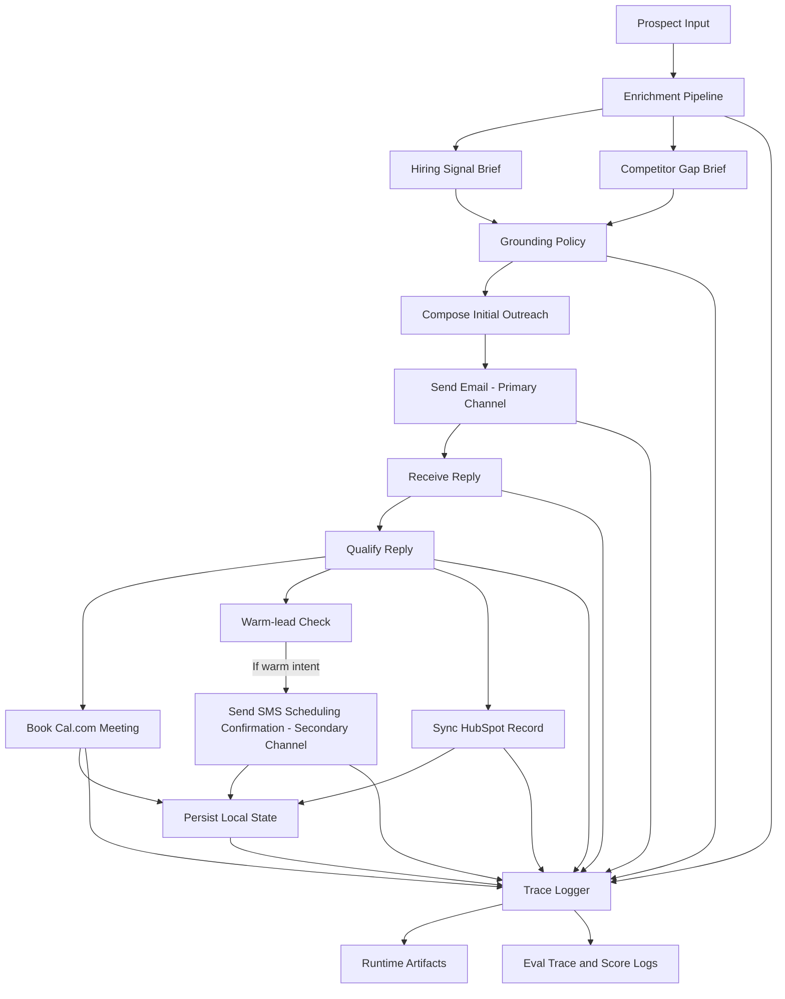

# Interim Submission Report

Date: April 23, 2026
Repository: week_10

## Executive Summary

This interim build demonstrates a working local end-to-end conversion flow in safe sink mode. The current system is email-first, uses SMS only for warm-lead scheduling, persists operational writes to local artifacts, and logs every major step for later review.

The latest regenerated runtime anchor is [artifacts/runtime/current-run.json](../artifacts/runtime/current-run.json) for lead `lead_b4bdbc85d4a2`. The corresponding artifact set includes the outbound email, synthetic reply, SMS confirmation, HubSpot snapshot, Cal.com booking, hiring brief, competitor-gap brief, and the agent trace log.

The benchmark layer is still intentionally honest about its status: `tau2-bench` file contracts exist, but the real baseline and reproduction runs have not yet been executed in this workspace. That means no pass@1 or confidence interval is claimed yet.

## 1) Architecture Overview and Key Design Decisions

### Architecture diagram

### Key decisions

- Email is the first outbound channel because that matches buyer workflow and keeps the first touch least intrusive.
- SMS is secondary and only activates after warm intent.
- Enrichment happens before outreach so the copy is grounded in evidence rather than generic sales language.
- Booking and CRM sync are downstream of qualification because they represent meaningful state transitions.
- Traces are attached to every major step so later reporting can point to concrete evidence.

## 2) Production Stack Status

| Component | Status | Evidence |
|---|---|---|
| Email | Verified in sink mode with a Resend-shaped adapter and local draft generation | [agent/channels/email/handler.py](../agent/channels/email/handler.py), [artifacts/runtime/email](../artifacts/runtime/email) |
| SMS | Verified in sink mode with an Africa's Talking-shaped adapter | [agent/channels/sms/handler.py](../agent/channels/sms/handler.py), [artifacts/runtime/sms](../artifacts/runtime/sms) |
| HubSpot | Verified as a local HubSpot MCP-shaped snapshot write path | [agent/crm/hubspot_mcp.py](../agent/crm/hubspot_mcp.py), [artifacts/runtime/hubspot](../artifacts/runtime/hubspot) |
| Cal.com | Verified as a local booking stub | [agent/calendar/calcom.py](../agent/calendar/calcom.py), [artifacts/runtime/calcom](../artifacts/runtime/calcom) |
| Langfuse layer | Trace contract verified locally through JSONL logging | [agent/traces/logger.py](../agent/traces/logger.py), [artifacts/traces/agent_trace_log.jsonl](../artifacts/traces/agent_trace_log.jsonl) |

## 3) Enrichment Pipeline Status

The enrichment pipeline is producing structured outputs for the required signal categories. The latest regenerated lead artifacts are:

- [artifacts/runtime/briefs/lead_b4bdbc85d4a2_hiring_signal.json](../artifacts/runtime/briefs/lead_b4bdbc85d4a2_hiring_signal.json)
- [artifacts/runtime/briefs/lead_b4bdbc85d4a2_competitor_gap.json](../artifacts/runtime/briefs/lead_b4bdbc85d4a2_competitor_gap.json)

Required signals covered:

- Crunchbase firmographics
- Job-post velocity
- layoffs.fyi / layoffs CSV lookup
- leadership-change detection
- AI maturity scoring on a 0 to 3 scale

## 4) Competitor Gap Brief Status

The top-quartile comparison pipeline is generating competitor-gap briefs for the test prospect. The current artifact includes the expected fields such as peer group definition, top quartile companies, prospect position summary, gap findings, and recommended hook.

## 5) tau2-Bench Baseline Score and Methodology

The benchmark scaffold exists in [eval/tau_bench/runner.py](../eval/tau_bench/runner.py). The current `score_log.json` and `trace_log.jsonl` contracts are placeholders until a real `tau2-bench` execution is run against the pinned model.

## 6) Honest Status Report

### Working now

- The local thin slice runs end to end.
- Runtime artifacts are generated for the current lead.
- Traces are recorded for each major step.

### Not working yet

- Real `tau2-bench` results are still pending.
- Live provider round-trips are not enabled.
- Some enrichment inputs still use scaffolded evidence text.

## 7) Evidence Index

- Runtime manifest: [artifacts/runtime/current-run.json](../artifacts/runtime/current-run.json)
- Agent traces: [artifacts/traces/agent_trace_log.jsonl](../artifacts/traces/agent_trace_log.jsonl)
- Eval score log: [eval/score_log.json](../eval/score_log.json)
- Eval trace log: [eval/trace_log.jsonl](../eval/trace_log.jsonl)
